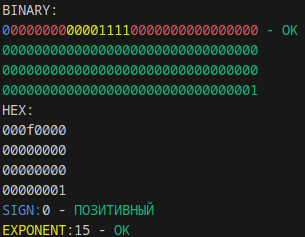

# Мини мануал по функциям, чтобы вы, козлы, знали что делают все функции, которые сейчас есть у нас.

---

## info_decimal(s21_decimal)

Эта функция выводит инфу по числу формата decimal.

Синий - знак
Желтый - биты экспоненты
Красный - биты, которые нельзя использовать
**Этот блок образует служебный байт**

Зелёный - значащие биты.

HEX - шестнадцатеричный вид числа

---

## get_sign(s21_decimal)

Возвращает 1 или 0. 

1 - число отрицательное

0 - число положительное

---

## set_sign_pos/neg(s21_decimal*)

Устанавливает знак в 0/1

---

## pause()

Украл эту функцию в целях дебагинга. Ждёт ввод пользователя прежде чем продолжить выполнение

---

## get_complement(s21_decimal value, s21_decimal *result)

Получает доп. код числа **value** и сохраняет в **result**. Также, если число изначально было в доп коде, ревёрсит доп. код в прямой.

---

## shift_decimal_left(s21_decimal *value, int shift)

Сдвигает **value** влево на **shift** битов.

---

## get_exponent(s21_decimal value)

Возвращает **int** значение экспоненты числа **value**

---

## set_exponent(s21_decimal *value, int exp)

Устанавливает значение экспоненты в числе **value** на **exp**

---

## level_exponent(s21_decimal *value_1, s21_decimal *value_2)

Уравнивает значение экспонент двух чисел, если они у них разные. Нужно для проведения арифметики

---

## s21_add(s21_decimal value_1, s21_decimal value_2, s21_decimal *result)

Складывает побитово два числа **value_1** и **value_2**. Сохраняет результат в **result**

---